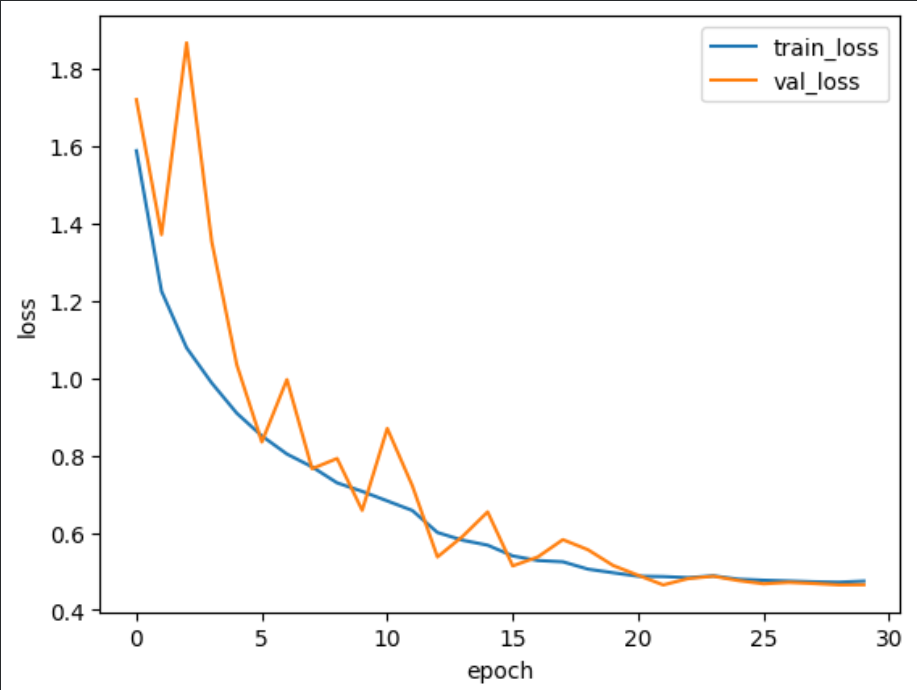

# CIFAR-10 Image Classification with a Custom CNN (TensorFlow/Keras)

This project trains a convolutional neural network (CNN) to classify images from the **CIFAR-10** dataset (10 classes, 32×32 RGB).  
It uses a clean **train/validation/test split**, an efficient 'tf.data' input pipeline**, **data augmentation**, and common training best practices like 
**Batch Normalization**, **Dropout**, and **learning-rate scheduling**.

**Final result (from my run): 83.7% test accuracy**

## Project Highlights

- ✅ Built a custom CNN using the Keras **Functional API**
- ✅ Efficient 'tf.data' pipeline: 'shuffle → map → batch → prefetch'
- ✅ Data augmentation during training only:
  - Random horizontal flip
  - Random translation
  - Random zoom
- ✅ Regularization and stability:
  - Batch Normalization after convolutions
  - Dropout in conv blocks and classifier head
  - Global Average Pooling to reduce parameters and overfitting
- ✅ Training callbacks:
  - Early stopping (restore best weights)
  - Reduce learning rate on plateau
  - Model checkpointing (save best model)

## Dataset

**CIFAR-10** contains 60,000 color images (32×32) in 10 classes:
- 50,000 training images
- 10,000 test images

This project uses:
- **Train:** 'train[10%:]' → 45,000 images  
- **Validation:** 'train[:10%]' → 5,000 images  
- **Test:** 'test' → 10,000 images

Loaded via 'tensorflow_datasets'.

---

## Model Architecture (Summary)

The network is built from three repeated blocks:

**Conv Block (repeated 3 times):**
- Conv2D (3×3, same, no bias)
- BatchNorm
- ReLU
- Conv2D (3×3, same, no bias)
- BatchNorm
- ReLU
- MaxPooling2D (2×2)
- Dropout

Then a classifier head:
- GlobalAveragePooling2D
- Dense(128, ReLU)
- Dropout
- Dense(10, Softmax)

**Total parameters:** ~306k

---

## Training Setup

- **Optimizer:** Adam (initial LR = '1e-3')
- **Loss:** Sparse Categorical Crossentropy (labels are integers 0–9)
- **Metric:** Accuracy
- **Epochs:** up to 30 (often stops early depending on validation)

### Callbacks
- EarlyStopping(monitor="val_accuracy", patience=5, restore_best_weights=True)
- ReduceLROnPlateau(monitor="val_loss", factor=0.5, patience=2)
- ModelCheckpoint("best_cifar10_model.keras", monitor="val_accuracy", save_best_only=True)

---

## Results

From the training run shown in the logs:

- **Best validation accuracy:** ~0.846
- **Test accuracy:** **0.8370**

-> Note: results can vary slightly depending on hardware and randomness, even with seeds set.

---
